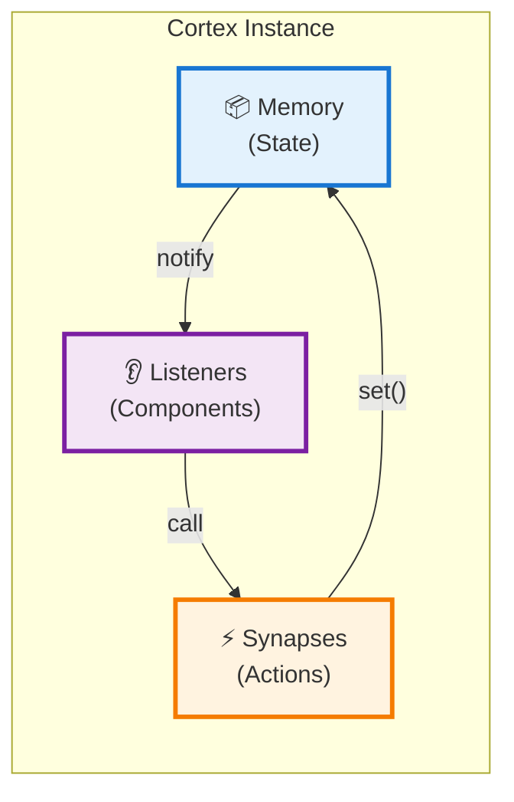
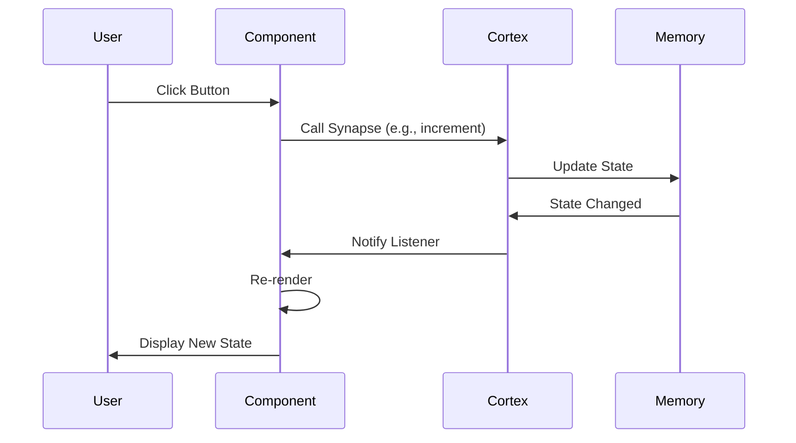
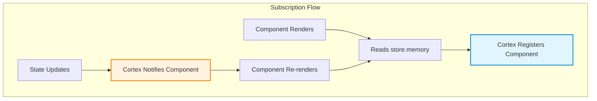
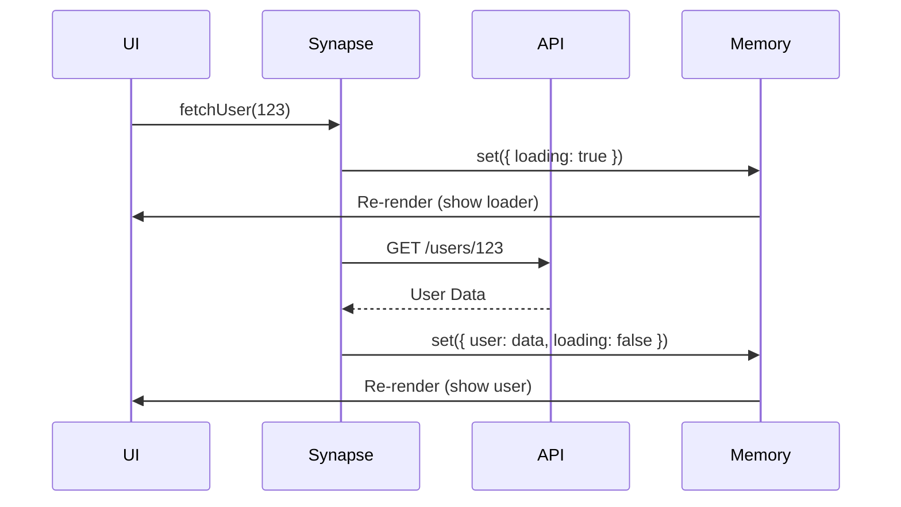

# Cortex: Deep Dive

The Cortex is Humn's state management system. It's named after the cerebral cortex because it's the "brain" of your application - the centralised location for all logic and data.

## Architecture



## Core Concepts

### Memory (State)

The Memory is the single source of truth for your application. It's a plain JavaScript object that holds all your data.

```javascript
const store = new Cortex({
  memory: {
    user: null,
    posts: [],
    isLoading: false,
    settings: {
      theme: 'light',
      notifications: true,
    },
  },
  synapses: (set, get) => ({
    // ... actions
  }),
})
```

**Key Principles:**

- Immutable updates (handled automatically)
- Can be deeply nested
- Always serialisable (no functions or symbols)

### Synapses (Actions)

Synapses are functions that modify the Memory. They're called "synapses" because they're the connections that trigger changes in the Cortex.

```javascript
synapses: (set, get) => ({
  login: (username) => set({ user: { username, loggedIn: true } }),

  logout: () => set({ user: null }),

  toggleTheme: () =>
    set((state) => {
      state.settings.theme = state.settings.theme === 'light' ? 'dark' : 'light'
    }),
})
```

**The `set` Function:**

The `set` function has two forms:

#### 1. Object Merge (Shallow)

```javascript
set({ count: 10, loading: false })
```

Shallow merges the object into the existing state.

#### 2. Functional Update (Deep)

```javascript
set((state) => {
  state.user.name = 'Alice'
  state.user.posts.push(newPost)
})
```

Receives a **mutable clone** of the state. You can mutate it directly, and Humn handles the immutability.

**The `get` Function:**

Returns the current state snapshot:

```javascript
addTodo: (text) => {
  const currentState = get()
  if (currentState.todos.length >= 100) {
    throw new Error('Too many todos!')
  }
  set((state) => {
    state.todos.push({ id: Date.now(), text, done: false })
  })
}
```

## Data Flow



## Subscription System

When a component reads from `store.memory`, it automatically subscribes to updates:

```javascript
const Counter = () => {
  const { count } = store.memory // ← Auto-subscribes!
  const { increment } = store.synapses

  return h('button', { onclick: increment }, count)
}
```

**How it works:**



### Selective Subscription

Only components that **read** from the Cortex will re-render:

```javascript
const ComponentA = () => {
  const { count } = store.memory // Subscribes to 'count'
  return h('div', {}, count)
}

const ComponentB = () => {
  const { user } = store.memory // Subscribes to 'user'
  return h('div', {}, user.name)
}

// If you update 'count', only ComponentA re-renders!
```

## Async Actions

Async logic is handled naturally in synapses:

```javascript
const userStore = new Cortex({
  memory: {
    user: null,
    loading: false,
    error: null,
  },

  synapses: (set) => ({
    fetchUser: async (id) => {
      // 1. Set loading
      set({ loading: true, error: null })

      try {
        // 2. Fetch data
        const res = await fetch(`/api/users/${id}`)
        const data = await res.json()

        // 3. Update with result
        set({ user: data, loading: false })
      } catch (err) {
        // 4. Handle error
        set({ error: err.message, loading: false })
      }
    },
  }),
})
```

**Async Flow:**



## Advanced Patterns

### Computed Values

You can derive values in your components:

```javascript
const TodoList = () => {
  const { todos } = store.memory

  // Computed
  const completedCount = todos.filter((t) => t.done).length
  const progress = (completedCount / todos.length) * 100

  return h('div', {}, [
    h('p', {}, `Progress: ${progress}%`),
    // ... render todos
  ])
}
```

### Middleware Pattern

You can wrap `set` to add logging or persistence:

```javascript
const createLogger = (set) => (updater) => {
  console.log('Before:', get())
  set(updater)
  console.log('After:', get())
}

const store = new Cortex({
  memory: { count: 0 },
  synapses: (set, get) => {
    const loggedSet = createLogger(set)

    return {
      increment: () =>
        loggedSet((s) => {
          s.count++
        }),
    }
  },
})
```

### Multiple Stores

You can create multiple Cortex instances for different domains:

```javascript
// stores/user-store.js
export const userStore = new Cortex({
  memory: { currentUser: null },
  synapses: (set) => ({
    /* ... */
  }),
})

// stores/cart-store.js
export const cartStore = new Cortex({
  memory: { items: [] },
  synapses: (set) => ({
    /* ... */
  }),
})
```

### Local Component State

You can create local stores inside components:

```javascript
const Timer = () => {
  // Create a local Cortex (not global)
  const local = new Cortex({
    memory: { seconds: 0 },
    synapses: (set) => ({
      tick: () =>
        set((s) => {
          s.seconds++
        }),
    }),
  })

  onMount(() => {
    const timer = setInterval(local.synapses.tick, 1000)
    onCleanup(() => clearInterval(timer))
  })

  return h('div', {}, `Elapsed: ${local.memory.seconds}s`)
}
```

## Best Practices

### ✓ Do

- Keep Memory serialisable (no functions, symbols, or class instances)
- Use mutative syntax in functional updates for clarity
- Create separate stores for different domains
- Handle loading and error states in async actions
- Use descriptive names for synapses (verbs: `fetchUser`, `updateSettings`)

### ✗ Don't

- Don't store derived data in Memory (compute it in components)
- Don't mutate Memory directly outside of synapses
- Don't create circular references in Memory
- Don't forget to handle errors in async actions
- Don't read from `store.memory` in synapses (use `get()` instead)

## Performance Tips

1. **Destructure selectively**: Only read what you need

   ```javascript
   const { count } = store.memory // Good
   const allState = store.memory // Subscribes to everything!
   ```

2. **Batch updates**: Multiple `set` calls in one synapse are batched

   ```javascript
   updateAll: () => {
     set({ a: 1 })
     set({ b: 2 })
     set({ c: 3 })
     // Only triggers one re-render
   }
   ```

3. **Use local state**: For component-specific data, use local Cortex instances

## Next Steps

- [Components](./components.md) - Learn how to build the Body
- [Lifecycle Hooks](./lifecycle-hooks.md) - Handle side effects
- [Examples](./examples.md) - See real-world patterns
