# Overview

## What is Humn?

Humn is a complete, reactive frontend library that combines the power of React/Svelte/Solid with built-in state management like Zustand/Redux - all in one elegant package.

### Core Philosophy

Humn enforces a strict separation between your application's **Cortex** (logic/state) and its **Body** (view). This biological metaphor isn't just cute - it's a fundamental architectural principle that makes your code more maintainable and testable.

## Why Humn?

### ✓ Zero Build Required

Write standard JavaScript. No JSX compilation needed (though you can use a compiler if you want).

### ✓ Built-in State Management

No need for Redux, Zustand, or MobX. The Cortex is included and handles:

- Deep nested updates
- Async actions
- Side effects
- Automatic re-rendering

### ✓ Mutative Syntax, Immutable Updates

Write `state.count++` and we handle the immutability for you.

### ✓ Scoped Styles

CSS-in-JS with zero configuration. Styles are automatically scoped to components.

### ✓ No Hook Rules

No "rules of hooks" to remember. No stale closures. Just straightforward JavaScript.

## Architecture Overview

```mermaid
graph TB
    subgraph "Humn Application"
        Cortex["🧠 Cortex (State)"]
        Body["👁️ Body (View)"]
        User["👤 User"]

        Cortex -->|"Auto-subscribes"| Body
        Body -->|"Triggers Synapses"| Cortex
        User -->|"Interacts"| Body
        Body -->|"Displays"| User
    end

    style Cortex fill:#e1f5ff,stroke:#0288d1,stroke-width:2px
    style Body fill:#f3e5f5,stroke:#7b1fa2,stroke-width:2px
```



**Key Concepts:**

1. **Cortex**: Your application's brain - holds all state and logic
2. **Synapses**: Functions that modify the Cortex memory
3. **Body**: Your UI components - pure functions that read from the Cortex
4. **Mount**: The entry point that connects your Body to the real DOM

## Quick Example

```javascript
import { Cortex, h, mount } from "humn";

// The Cortex (State + Logic)
const store = new Cortex({
  memory: { count: 0 },
  synapses: (set) => ({
    increment: () =>
      set((state) => {
        state.count++;
      }),
  }),
});

// The Body (UI)
const App = () => {
  const { count } = store.memory;
  const { increment } = store.synapses;

  return h("button", { onclick: increment }, `Count: ${count}`);
};

// Mount
mount(document.getElementById("app"), App);
```

## Project Structure

A typical Humn project looks like this:

```
my-humn-app/
├── src/
│   ├── stores/
│   │   └── app-store.js      # Cortex definitions
│   ├── components/
│   │   └── Counter.js         # UI components
│   ├── styles/
│   │   └── app-styles.js      # Scoped CSS
│   └── main.js                # Entry point
├── index.html
└── package.json
```

## Comparison with Other Libraries

| Feature          | Humn     | React + Redux | Svelte   | Solid    |
| ---------------- | -------- | ------------- | -------- | -------- |
| State Management | Built-in | External      | Built-in | Built-in |
| Build Step       | Optional | Required      | Required | Required |
| Learning Curve   | Low      | High          | Medium   | Medium   |
| Bundle Size      | ~5KB     | ~40KB+        | ~10KB    | ~7KB     |
| Mutative Updates | ✓        | ✗             | ✗        | ✗        |

## Documentation Structure

### Getting Started

- [Getting Started](./getting-started.md) - Install and create your first app
- [Overview](./overview.md) - Understand Humn's philosophy

### Core Concepts

- [State Management](./state-management.md) - Basic Cortex usage
- [Cortex Deep Dive](./cortex-deep-dive.md) - Advanced state patterns
- [Components](./components.md) - Building the Body
- [Virtual DOM](./virtual-dom.md) - How reconciliation works
- [Lifecycle Hooks](./lifecycle-hooks.md) - Component lifecycle
- [Scoped CSS](./scoped-css.md) - Styling components

### Practical Guides

- [Examples](./examples.md) - Real-world patterns
- [Testing](./testing.md) - Testing your Humn apps
- [API Reference](./api-reference.md) - Complete API documentation

## Quick Links

**New to Humn?** Start with [Getting Started](./getting-started.md)

**Coming from React?** Read [Cortex Deep Dive](./cortex-deep-dive.md) to understand state management

**Building an app?** Check out [Examples](./examples.md) for common patterns

**Need help?** See [API Reference](./api-reference.md) for all available functions
