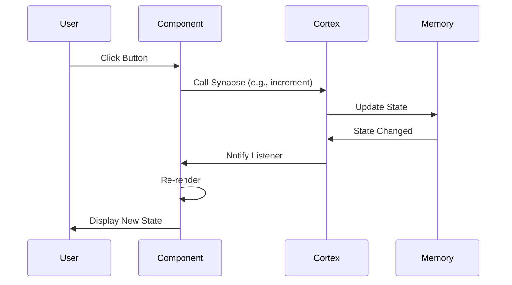
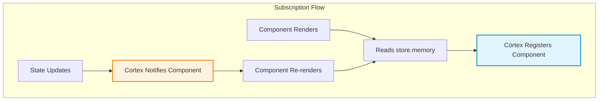
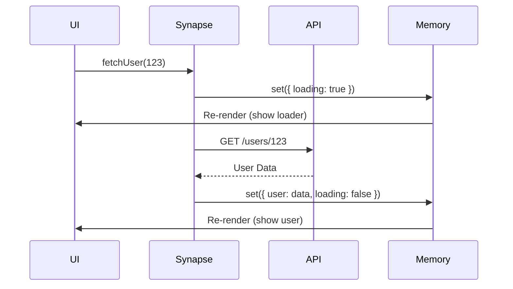

# Cortex: Deep Dive

The Cortex is Humn's state management system. It's named after the cerebral cortex because it's the "brain" of your application - the centralised location for all logic and data.

## Architecture

```mermaid
graph LR
    subgraph "Cortex Instance"
        Memory["📦 Memory<br/>(State)"]
        Synapses["⚡ Synapses<br/>(Actions)"]
        Listeners["👂 Listeners<br/>(Components)"]

        Synapses -->|"set()"| Memory
        Memory -->|"notify"| Listeners
        Listeners -->|"call"| Synapses
    end

    style Memory fill:#e3f2fd,stroke:#1976d2,stroke-width:3px
    style Synapses fill:#fff3e0,stroke:#f57c00,stroke-width:3px
    style Listeners fill:#f3e5f5,stroke:#7b1fa2,stroke-width:3px
```



## Core Concepts

### Memory (State)

The Memory is the single source of truth for your application. It's a plain JavaScript object that holds all your data.

```javascript
const store = new Cortex({
  memory: {
    user: null,
    posts: [],
    isLoading: false,
    settings: {
      theme: 'light',
      notifications: true,
    },
  },
  synapses: (set, get) => ({
    // ... actions
  }),
})
```

**Key Principles:**

- Immutable updates (handled automatically)
- Can be deeply nested
- Always serialisable (no functions or symbols)

### Synapses (Actions)

Synapses are functions that modify the Memory. They're called "synapses" because they're the connections that trigger changes in the Cortex.

```javascript
synapses: (set, get) => ({
  login: (username) => set({ user: { username, loggedIn: true } }),

  logout: () => set({ user: null }),

  toggleTheme: () => {
    const currentState = get()
    const newTheme = currentState.settings.theme === 'light' ? 'dark' : 'light'
    set((state) => {
      state.settings.theme = newTheme
    })
  },
})
```

**The `set` Function:**

The `set` function has two forms:

#### 1. Object Merge (Shallow)

```javascript
set({ count: 10, loading: false })
```

Shallow merges the object into the existing state.

#### 2. Functional Update (Deep)

```javascript
set((state) => {
  state.user.name = 'Alice'
  state.user.posts.push(newPost)
})
```

Receives a **mutable clone** of the state. You can mutate it directly, and Humn handles the immutability.

**The `get` Function:**

Returns the current state snapshot:

```javascript
addTodo: (text) => {
  const currentState = get()
  if (currentState.todos.length >= 100) {
    throw new Error('Too many todos!')
  }
  set((state) => {
    state.todos.push({ id: Date.now(), text, done: false })
  })
}
```

## Data Flow



## Subscription System

When a component reads from `store.memory`, it automatically subscribes to updates:

```javascript
const Counter = () => {
  const { count } = store.memory // ← Auto-subscribes!
  const { increment } = store.synapses

  return h('button', { onclick: increment }, count)
}
```

**How it works:**



### Selective Subscription

Only components that **read** from the Cortex will re-render:

```javascript
const ComponentA = () => {
  const { count } = store.memory // Subscribes to 'count'
  return h('div', {}, count)
}

const ComponentB = () => {
  const { user } = store.memory // Subscribes to 'user'
  return h('div', {}, user.name)
}

// If you update 'count', only ComponentA re-renders!
```

## Async Actions

Async logic is handled naturally in synapses:

```javascript
const userStore = new Cortex({
  memory: {
    user: null,
    loading: false,
    error: null,
  },

  synapses: (set) => ({
    fetchUser: async (id) => {
      // 1. Set loading
      set({ loading: true, error: null })

      try {
        // 2. Fetch data
        const res = await fetch(`/api/users/${id}`)
        const data = await res.json()

        // 3. Update with result
        set({ user: data, loading: false })
      } catch (err) {
        // 4. Handle error
        set({ error: err.message, loading: false })
      }
    },
  }),
})
```

**Async Flow:**



## Advanced Patterns

### Computed Values

You can derive values in your components:

```javascript
const TodoList = () => {
  const { todos } = store.memory

  // Computed
  const completedCount = todos.filter((t) => t.done).length
  const progress = (completedCount / todos.length) * 100

  return h('div', {}, [
    h('p', {}, `Progress: ${progress}%`),
    // ... render todos
  ])
}
```

### Middleware Pattern

You can wrap `set` to add logging or persistence:

```javascript
const createLogger = (set) => (updater) => {
  console.log('Before:', get())
  set(updater)
  console.log('After:', get())
}

const store = new Cortex({
  memory: { count: 0 },
  synapses: (set, get) => {
    const loggedSet = createLogger(set)

    return {
      increment: () =>
        loggedSet((s) => {
          s.count++
        }),
    }
  },
})
```

### Multiple Stores

You can create multiple Cortex instances for different domains:

```javascript
// stores/user-store.js
export const userStore = new Cortex({
  memory: { currentUser: null },
  synapses: (set) => ({
    /* ... */
  }),
})

// stores/cart-store.js
export const cartStore = new Cortex({
  memory: { items: [] },
  synapses: (set) => ({
    /* ... */
  }),
})
```

### Local Component State

You can create local stores inside components:

```javascript
const Timer = () => {
  // Create a local Cortex (not global)
  const local = new Cortex({
    memory: { seconds: 0 },
    synapses: (set) => ({
      tick: () =>
        set((s) => {
          s.seconds++
        }),
    }),
  })
****
  onMount(() => {
    const timer = setInterval(local.synapses.tick, 1000)
    onCleanup(() => clearInterval(timer))
  })

  return h('div', {}, `Elapsed: ${local.memory.seconds}s`)
}
```

### TypeScript/JSDoc Typing

Humn's **Cortex** is implemented in vanilla JavaScript but offers **first‑class TypeScript support** through JSDoc generics.  
This means developers get **autocompletion, type safety, and IntelliSense** — even in JavaScript files - without a separate TypeScript build step.

---

## Typing Overview

When creating a Cortex instance, you define two types:

1. **Memory** – the shape of your application state
2. **Synapses** – the functions (actions) that modify that state

```ts
import { Cortex, persist } from 'humn'

type AppMemory = {
  user: {
    name: string | null
    email: string | null
    mobile: string | null
  }
  settings: {
    theme: 'light' | 'dark'
  }
  open: boolean
  messages: { text: string; sender: 'user' | 'server' }[]
  currentMessage: string
}

type AppSynapses = {
  setName: (name: string | null) => void
  setEmail: (email: string | null) => void
  setMobile: (mobile: string | null) => void
  toggleTheme: () => void
  setOpen: (open: boolean) => void
  addMessage: (message: { text: string; sender: 'user' | 'server' }) => void
  setCurrentMessage: (currentMessage: string) => void
}
```

Then instantiate a fully‑typed Cortex:

```ts
export const appCortex = new Cortex<AppMemory, AppSynapses>({
  memory: {
    user: persist({
      name: null,
      email: null,
      mobile: null,
    }),
    settings: persist({
      theme: 'light',
    }),
    open: persist(false),
    messages: persist([]),
    currentMessage: '',
  },

  synapses: (set, get) => ({
    setName: (name) => set((state) => (state.user.name = name)),
    setEmail: (email) => set((state) => (state.user.email = email)),
    setMobile: (mobile) => set((state) => (state.user.mobile = mobile)),
    toggleTheme: () => {
      const currentState = get()
      const newTheme =
        currentState.settings.theme === 'light' ? 'dark' : 'light'
      set((state) => {
        state.settings.theme = newTheme
      })
    },
    setOpen: (open) => set({ open }),
    addMessage: ({ text, sender }) =>
      set((state) => state.messages.push({ text, sender })),
    setCurrentMessage: (currentMessage) => set({ currentMessage }),
  }),
})
```

---

## IntelliSense Magic ✨

TypeScript users now get perfect typings throughout:

```ts
// ✅ Typed access to memory
appCortex.memory.user.name // string | null
appCortex.memory.settings.theme // "light" | "dark"
appCortex.memory.messages[0].text // string

// ✅ Typed actions
appCortex.synapses.setName('Keeghan')
appCortex.synapses.toggleTheme()
```

Inside synapses, typings flow automatically:

```ts
const toggleTheme = () => {
  const current = get() // type: AppMemory
  const theme = current.settings.theme // "light" | "dark"

  set((state) => {
    state.settings.theme = theme === 'light' ? 'dark' : 'light'
  })
}
```

---

## Persisted Fields

Any key can be persisted simply by wrapping it with `persist()`.  
Cortex automatically unwraps persisted types, so the public API remains identical:

```ts
appCortex.memory.settings.theme // "light" | "dark"
```

No `.initial` or other metadata is exposed in typings.

---

## Type‑Safe `set()` and `get()`

`set()` supports two fully‑typed update modes:

### 1. Object Merge

```ts
set({ open: true })
```

Only keys from your memory type are allowed.

### 2. Functional Update

```ts
set((state) => {
  state.user.name = 'Alice'
  state.settings.theme = 'dark'
})
```

Assignments that return values are safe — their return type is ignored by the type system.

---

## Derived Data

Derived values stay strongly typed:

```ts
const messageCount = appCortex.memory.messages.length
const isDark = appCortex.memory.settings.theme === 'dark'
```

No separate selector types or mapping functions required.

---

## Error Checking Example

TypeScript validation prevents invalid mutations:

```ts
set((state) => (state.users.email = 'oops'))
// ❌ Property 'users' does not exist on type 'AppMemory'
```

---

## Using Cortex in JavaScript (with JSDoc)

Even in plain `.js` files, you can get autocompletion and static checking by using JSDoc annotations:

```js
/**
 * @typedef {object} User
 * @property {string|null} name
 * @property {string|null} email
 * @property {string|null} mobile
 */

/** @typedef {'light'|'dark'} Theme */

/**
 * @typedef {object} AppMemory
 * @property {User} user
 * @property {{ theme: Theme }} settings
 * @property {boolean} open
 * @property {{ text: string, sender: 'user'|'server' }[]} messages
 * @property {string} currentMessage
 */

/**
 * @typedef {object} AppSynapses
 * @property {(name: string|null) => void} setName
 * @property {() => void} toggleTheme
 */

/** @type {import('humn').Cortex<AppMemory, AppSynapses>} */
export const appCortex = new Cortex({
  memory: {
    user: persist({ name: null, email: null, mobile: null }),
    settings: persist({ theme: 'light' }),
    open: false,
    messages: [],
    currentMessage: '',
  },
  synapses: (set, get) => ({
    setName: (name) => set((s) => (s.user.name = name)),
    toggleTheme: () => {
      const { settings } = get()
      set(
        (s) =>
          (s.settings.theme = settings.theme === 'light' ? 'dark' : 'light'),
      )
    },
  }),
})
```

VSCode and other modern editors will give you full IntelliSense with this approach.

## Best Practices

### ✓ Do

- Keep Memory serialisable (no functions, symbols, or class instances)
- Use mutative syntax in functional updates for clarity
- Create separate stores for different domains
- Handle loading and error states in async actions
- Use descriptive names for synapses (verbs: `fetchUser`, `updateSettings`)

### ✗ Don't

- Don't store derived data in Memory (compute it in components)
- Don't mutate Memory directly outside of synapses
- Don't create circular references in Memory
- Don't forget to handle errors in async actions
- Don't read from `store.memory` in synapses (use `get()` instead)

## Performance Tips

1. **Destructure selectively**: Only read what you need

   ```javascript
   const { count } = store.memory // Good
   const allState = store.memory // Subscribes to everything!
   ```

2. **Batch updates**: Multiple `set` calls in one synapse are batched

   ```javascript
   updateAll: () => {
     set({ a: 1 })
     set({ b: 2 })
     set({ c: 3 })
     // Only triggers one re-render
   }
   ```

3. **Use local state**: For component-specific data, use local Cortex instances

## Next Steps

- [Components](./components.md) - Learn how to build the Body
- [Lifecycle Hooks](./lifecycle-hooks.md) - Handle side effects
- [Examples](./examples.md) - See real-world patterns
