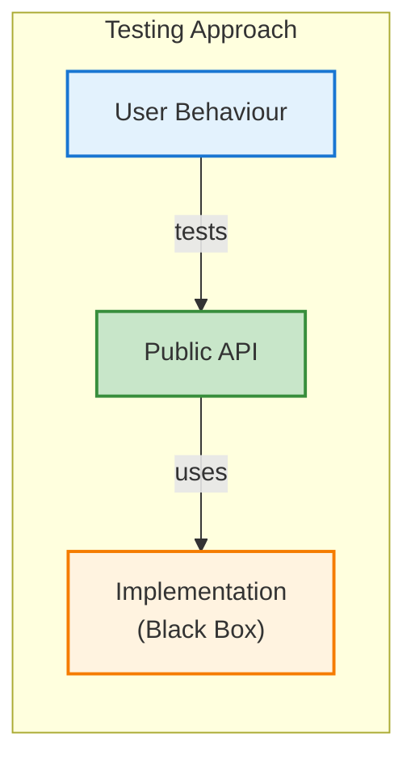

# Testing Guide

This guide follows behaviour-driven testing principles. We test **what** the application does, not **how** it does it.

## Philosophy



**Key Principles:**

- Test through the public API only
- No 1:1 mapping between test files and source files
- 100% coverage through behaviour tests, not implementation tests
- Tests document expected business behaviour

## Setup

```bash
npm install --save-dev vitest @testing-library/dom
```

**vitest.config.js:**

```javascript
import { defineConfig } from "vitest/config";

export default defineConfig({
  test: {
    environment: "jsdom",
    coverage: {
      provider: "v8",
      reporter: ["text", "html"],
      include: ["src/**/*.js"],
    },
  },
});
```

## Testing Cortex (State Management)

### Basic State Updates

```javascript
// __tests__/user-management.test.js
import { describe, it, expect } from "vitest";
import { Cortex } from "humn";

describe("User management", () => {
  it("should update user name", () => {
    const store = new Cortex({
      memory: { user: { name: "Alice" } },
      synapses: (set) => ({
        updateName: (name) => set({ user: { name } }),
      }),
    });

    store.synapses.updateName("Bob");

    expect(store.memory.user.name).toBe("Bob");
  });

  it("should handle nested updates", () => {
    const store = new Cortex({
      memory: { settings: { theme: "light", lang: "en" } },
      synapses: (set) => ({
        setTheme: (theme) =>
          set((state) => {
            state.settings.theme = theme;
          }),
      }),
    });

    store.synapses.setTheme("dark");

    expect(store.memory.settings.theme).toBe("dark");
    expect(store.memory.settings.lang).toBe("en"); // Unchanged
  });
});
```

### Async Operations

```javascript
import { describe, it, expect, vi } from "vitest";

describe("Data fetching", () => {
  it("should fetch user and update state", async () => {
    // Mock fetch
    global.fetch = vi.fn(() =>
      Promise.resolve({
        ok: true,
        json: () => Promise.resolve({ id: 1, name: "Alice" }),
      })
    );

    const store = new Cortex({
      memory: { user: null, loading: false },
      synapses: (set) => ({
        fetchUser: async (id) => {
          set({ loading: true });
          const res = await fetch(`/api/users/${id}`);
          const data = await res.json();
          set({ user: data, loading: false });
        },
      }),
    });

    // Before fetch
    expect(store.memory.loading).toBe(false);
    expect(store.memory.user).toBeNull();

    // Trigger fetch
    await store.synapses.fetchUser(1);

    // After fetch
    expect(store.memory.loading).toBe(false);
    expect(store.memory.user).toEqual({ id: 1, name: "Alice" });
    expect(fetch).toHaveBeenCalledWith("/api/users/1");
  });

  it("should handle fetch errors", async () => {
    global.fetch = vi.fn(() => Promise.resolve({ ok: false }));

    const store = new Cortex({
      memory: { user: null, error: null, loading: false },
      synapses: (set) => ({
        fetchUser: async (id) => {
          set({ loading: true, error: null });
          try {
            const res = await fetch(`/api/users/${id}`);
            if (!res.ok) throw new Error("Fetch failed");
            const data = await res.json();
            set({ user: data, loading: false });
          } catch (err) {
            set({ error: err.message, loading: false });
          }
        },
      }),
    });

    await store.synapses.fetchUser(1);

    expect(store.memory.error).toBe("Fetch failed");
    expect(store.memory.user).toBeNull();
    expect(store.memory.loading).toBe(false);
  });
});
```

## Testing Components

### Simple Rendering

```javascript
import { describe, it, expect } from "vitest";
import { h, mount } from "humn";

describe("Greeting component", () => {
  it("should display greeting message", () => {
    const Greeting = ({ name }) => {
      return h("h1", {}, `Hello, ${name}!`);
    };

    const container = document.createElement("div");
    mount(container, () => h(Greeting, { name: "Alice" }));

    expect(container.innerHTML).toBe("<h1>Hello, Alice!</h1>");
  });
});
```

### Interactive Components

```javascript
describe("Counter component", () => {
  it("should increment count when button clicked", () => {
    const store = new Cortex({
      memory: { count: 0 },
      synapses: (set) => ({
        increment: () =>
          set((s) => {
            s.count++;
          }),
      }),
    });

    const Counter = () => {
      const { count } = store.memory;
      const { increment } = store.synapses;

      return h("div", {}, [
        h("p", { id: "count" }, `Count: ${count}`),
        h("button", { id: "btn", onclick: increment }, "Increment"),
      ]);
    };

    const container = document.createElement("div");
    mount(container, Counter);

    // Initial state
    expect(container.querySelector("#count").textContent).toBe("Count: 0");

    // Click button
    container.querySelector("#btn").click();

    // After click
    expect(container.querySelector("#count").textContent).toBe("Count: 1");
  });
});
```

### Conditional Rendering

```javascript
describe("Login form", () => {
  it("should show error message on invalid login", async () => {
    global.fetch = vi.fn(() => Promise.resolve({ ok: false }));

    const authStore = new Cortex({
      memory: { error: null, loading: false },
      synapses: (set) => ({
        login: async (email, password) => {
          set({ loading: true, error: null });
          const res = await fetch("/api/login", {
            method: "POST",
            body: JSON.stringify({ email, password }),
          });

          if (!res.ok) {
            set({ error: "Invalid credentials", loading: false });
          } else {
            set({ loading: false });
          }
        },
      }),
    });

    const LoginForm = () => {
      const { error, loading } = authStore.memory;
      const { login } = authStore.synapses;

      return h("div", {}, [
        error ? h("p", { id: "error" }, error) : null,
        h(
          "button",
          {
            id: "submit",
            onclick: () => login("test@example.com", "wrong"),
          },
          loading ? "Loading..." : "Login"
        ),
      ]);
    };

    const container = document.createElement("div");
    mount(container, LoginForm);

    // No error initially
    expect(container.querySelector("#error")).toBeNull();

    // Click login
    container.querySelector("#submit").click();

    // Wait for async operation
    await new Promise((resolve) => setTimeout(resolve, 0));

    // Error appears
    expect(container.querySelector("#error").textContent).toBe(
      "Invalid credentials"
    );
  });
});
```

### Lists with Keys

```javascript
describe("Todo list", () => {
  it("should reorder items without recreating DOM nodes", () => {
    const store = new Cortex({
      memory: {
        todos: [
          { id: 1, text: "A" },
          { id: 2, text: "B" },
          { id: 3, text: "C" },
        ],
      },
      synapses: (set) => ({
        reverse: () =>
          set((s) => {
            s.todos.reverse();
          }),
      }),
    });

    const TodoList = () => {
      const { todos } = store.memory;
      return h(
        "ul",
        {},
        todos.map((todo) =>
          h("li", { key: todo.id, id: `item-${todo.id}` }, todo.text)
        )
      );
    };

    const container = document.createElement("div");
    mount(container, TodoList);

    // Capture DOM references
    const firstItem = container.querySelector("#item-1");
    const lastItem = container.querySelector("#item-3");

    // Verify initial order
    expect(container.querySelectorAll("li")[0].textContent).toBe("A");
    expect(container.querySelectorAll("li")[2].textContent).toBe("C");

    // Reverse the list
    store.synapses.reverse();

    // Verify new order
    expect(container.querySelectorAll("li")[0].textContent).toBe("C");
    expect(container.querySelectorAll("li")[2].textContent).toBe("A");

    // Verify DOM nodes were reused (keyed diffing)
    expect(container.querySelector("#item-1")).toBe(firstItem);
    expect(container.querySelector("#item-3")).toBe(lastItem);
  });
});
```

## Testing Lifecycle Hooks

```javascript
import { onMount, onCleanup } from "humn";
import { describe, it, expect, vi } from "vitest";

describe("Component lifecycle", () => {
  it("should call onMount when component appears", async () => {
    const mountSpy = vi.fn();

    const Component = () => {
      onMount(mountSpy);
      return h("div", {}, "Mounted");
    };

    const container = document.createElement("div");
    mount(container, Component);

    // onMount is async
    await new Promise((resolve) => setTimeout(resolve, 0));

    expect(mountSpy).toHaveBeenCalledTimes(1);
  });

  it("should call onCleanup when component unmounts", async () => {
    const cleanupSpy = vi.fn();

    const store = new Cortex({
      memory: { show: true },
      synapses: (set) => ({
        toggle: () =>
          set((s) => {
            s.show = !s.show;
          }),
      }),
    });

    const Child = () => {
      onCleanup(cleanupSpy);
      return h("div", {}, "Child");
    };

    const App = () => {
      const { show } = store.memory;
      return h("div", {}, [show ? h(Child, { key: "child" }) : null]);
    };

    const container = document.createElement("div");
    mount(container, App);

    // Component is mounted
    expect(container.textContent).toContain("Child");
    expect(cleanupSpy).not.toHaveBeenCalled();

    // Unmount component
    store.synapses.toggle();

    // Cleanup called
    expect(container.textContent).not.toContain("Child");
    expect(cleanupSpy).toHaveBeenCalledTimes(1);
  });

  it("should cleanup timers", async () => {
    const Clock = () => {
      const local = new Cortex({
        memory: { time: 0 },
        synapses: (set) => ({
          tick: () =>
            set((s) => {
              s.time++;
            }),
        }),
      });

      onMount(() => {
        const timer = setInterval(local.synapses.tick, 100);
        onCleanup(() => clearInterval(timer));
      });

      return h("div", { id: "clock" }, local.memory.time);
    };

    const store = new Cortex({
      memory: { show: true },
      synapses: (set) => ({
        hide: () => set({ show: false }),
      }),
    });

    const App = () => {
      const { show } = store.memory;
      return show ? h(Clock, { key: "clock" }) : h("div", {}, "No clock");
    };

    const container = document.createElement("div");
    mount(container, App);

    // Wait for onMount
    await new Promise((resolve) => setTimeout(resolve, 0));

    // Wait for timer ticks
    await new Promise((resolve) => setTimeout(resolve, 250));

    const clockEl = container.querySelector("#clock");
    const tickCount = parseInt(clockEl.textContent);

    // Should have ticked at least twice
    expect(tickCount).toBeGreaterThanOrEqual(2);

    // Unmount
    store.synapses.hide();

    // Wait to ensure timer is stopped
    await new Promise((resolve) => setTimeout(resolve, 200));

    // Mount again
    store.synapses.hide(); // Toggle back
    await new Promise((resolve) => setTimeout(resolve, 0));

    // New clock should start at 0
    const newClockEl = container.querySelector("#clock");
    expect(newClockEl.textContent).toBe("0");
  });
});
```

## Test Data Patterns

### Factory Functions

```javascript
// __tests__/factories/user-factory.js
export const createUser = (overrides = {}) => ({
  id: 1,
  name: "Test User",
  email: "test@example.com",
  age: 25,
  ...overrides,
});

export const createUsers = (count, overrides = {}) =>
  Array.from({ length: count }, (_, i) =>
    createUser({ id: i + 1, ...overrides })
  );

// Usage
describe("User list", () => {
  it("should display all users", () => {
    const users = createUsers(3);
    // ... test implementation
  });

  it("should handle users with long names", () => {
    const user = createUser({
      name: "A".repeat(100),
    });
    // ... test implementation
  });
});
```

### Validation with Zod

```javascript
import { z } from "zod";

const UserSchema = z.object({
  id: z.number().positive(),
  name: z.string().min(1),
  email: z.string().email(),
  age: z.number().min(18),
});

export const createUser = (overrides = {}) => {
  const user = {
    id: 1,
    name: "Test User",
    email: "test@example.com",
    age: 25,
    ...overrides,
  };

  // Validate at test setup time
  return UserSchema.parse(user);
};

// This will throw at test setup:
const invalidUser = createUser({ age: 15 }); // ❌ Age must be >= 18
```

## Integration Tests

Test complete features end-to-end:

```javascript
describe("Todo application", () => {
  it("should handle complete todo workflow", () => {
    const store = new Cortex({
      memory: {
        todos: [],
        input: "",
      },
      synapses: (set) => ({
        setInput: (val) => set({ input: val }),
        addTodo: () =>
          set((s) => {
            if (s.input.trim()) {
              s.todos.push({
                id: Date.now(),
                text: s.input,
                done: false,
              });
              s.input = "";
            }
          }),
        toggle: (id) =>
          set((s) => {
            const todo = s.todos.find((t) => t.id === id);
            if (todo) todo.done = !todo.done;
          }),
        remove: (id) =>
          set((s) => {
            s.todos = s.todos.filter((t) => t.id !== id);
          }),
      }),
    });

    const TodoApp = () => {
      const { todos, input } = store.memory;
      const { setInput, addTodo, toggle, remove } = store.synapses;

      return h("div", {}, [
        h("input", {
          id: "input",
          value: input,
          oninput: (e) => setInput(e.target.value),
        }),
        h("button", { id: "add", onclick: addTodo }, "Add"),
        h(
          "ul",
          {},
          todos.map((todo) =>
            h("li", { key: todo.id }, [
              h("input", {
                type: "checkbox",
                checked: todo.done,
                onchange: () => toggle(todo.id),
              }),
              h("span", {}, todo.text),
              h(
                "button",
                {
                  onclick: () => remove(todo.id),
                },
                "Delete"
              ),
            ])
          )
        ),
      ]);
    };

    const container = document.createElement("div");
    mount(container, TodoApp);

    // 1. Add first todo
    const input = container.querySelector("#input");
    const addBtn = container.querySelector("#add");

    input.value = "Buy milk";
    input.dispatchEvent(new Event("input"));
    addBtn.click();

    expect(container.querySelectorAll("li").length).toBe(1);
    expect(container.querySelector("span").textContent).toBe("Buy milk");

    // 2. Add second todo
    input.value = "Walk dog";
    input.dispatchEvent(new Event("input"));
    addBtn.click();

    expect(container.querySelectorAll("li").length).toBe(2);

    // 3. Toggle first todo
    container.querySelectorAll('input[type="checkbox"]')[0].click();

    expect(store.memory.todos[0].done).toBe(true);
    expect(store.memory.todos[1].done).toBe(false);

    // 4. Delete second todo
    container.querySelectorAll("button")[1].click();

    expect(container.querySelectorAll("li").length).toBe(1);
    expect(container.querySelector("span").textContent).toBe("Buy milk");
  });
});
```

## Anti-Patterns to Avoid

### ❌ Testing Implementation Details

```javascript
// BAD: Testing internal method calls
it("should call validateInput", () => {
  const spy = vi.spyOn(validator, "validateInput");
  store.synapses.addTodo("Test");
  expect(spy).toHaveBeenCalled();
});

// GOOD: Testing behaviour
it("should reject invalid todos", () => {
  store.synapses.addTodo("");
  expect(store.memory.todos.length).toBe(0);
});
```

### ❌ Using `let` and `beforeEach`

```javascript
// BAD: Shared mutable state
let store;
beforeEach(() => {
  store = createStore();
});

// GOOD: Factory per test
it("should increment count", () => {
  const store = createStore();
  store.synapses.increment();
  expect(store.memory.count).toBe(1);
});
```

### ❌ Testing Internal Functions

```javascript
// BAD: Exporting and testing validation function
export const validateEmail = (email) => /\S+@\S+/.test(email);

// GOOD: Test through public API
it("should reject invalid email", () => {
  store.synapses.setEmail("invalid");
  expect(store.memory.errors.email).toBe("Invalid email");
});
```

## Coverage Tips

1. **Run coverage**: `npm test -- --coverage`
2. **Aim for 100%** through behaviour tests
3. **If uncovered**: Either unreachable code (delete it) or missing test case
4. **Don't test**: Framework code, third-party libraries

## Next Steps

- [Examples](./examples.md) - See testable patterns in action
- [API Reference](./api-reference.md) - Complete API documentation
