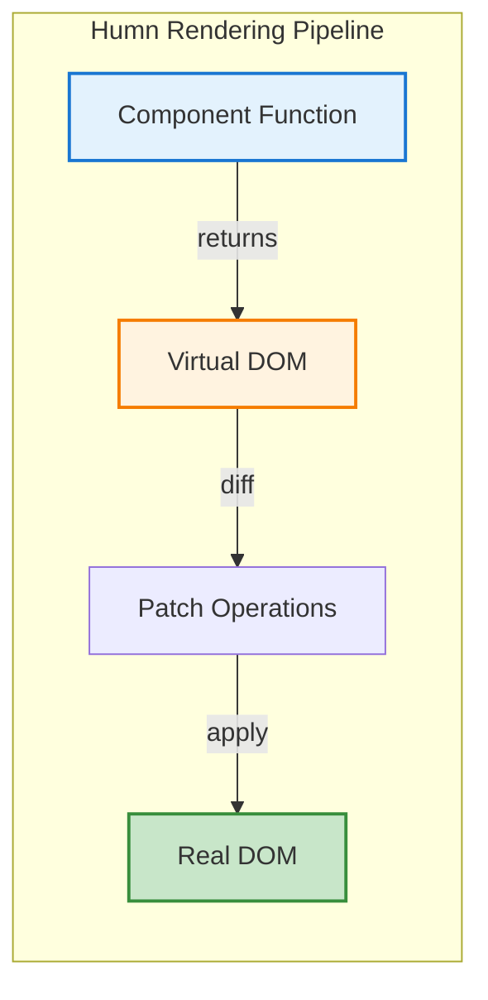
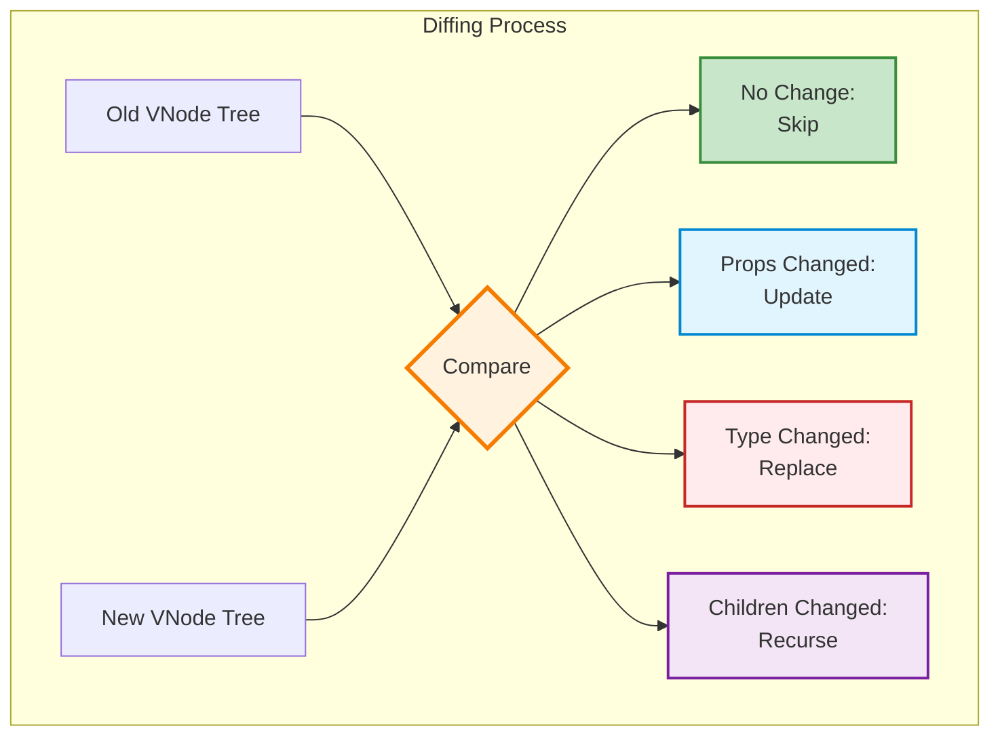
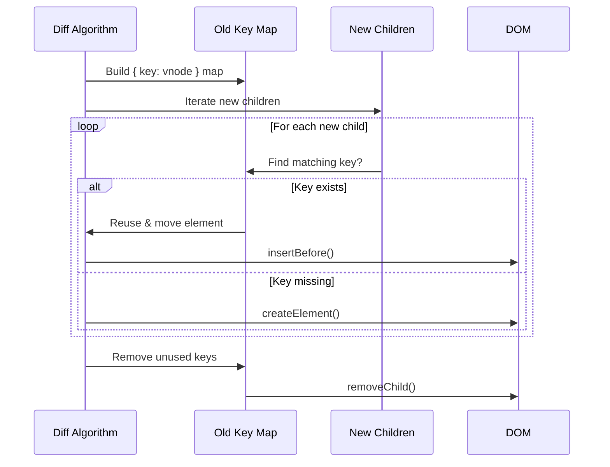

# Virtual DOM & Reconciliation

Humn uses a lightweight Virtual DOM (V-DOM) system to efficiently update the real DOM. Understanding how this works will help you write more performant applications.

## What is a Virtual DOM?

A Virtual DOM is a JavaScript representation of your UI. Instead of directly manipulating the DOM (which is slow), you describe what you want, and Humn figures out the minimal changes needed.



## The `h()` Function

The `h()` function (short for "hyperscript") creates Virtual DOM nodes:

```javascript
import { h } from "humn";

// Creates a VNode: { tag: 'div', props: { class: 'card' }, children: [...] }
h("div", { class: "card" }, [h("h1", {}, "Title"), h("p", {}, "Content")]);
```

**Signature:**

```javascript
h(tag, props, children) → VNode
```

- **tag**: HTML tag name (`'div'`, `'span'`) or component function
- **props**: Object of attributes/events (`{ class: 'btn', onclick: handler }`)
- **children**: Array of child VNodes or strings/numbers

## VNode Structure

A VNode is a plain JavaScript object:

```javascript
{
  tag: 'button',
  props: {
    class: 'primary',
    onclick: handleClick
  },
  children: ['Click me'],
  el: null  // Will hold the real DOM element after creation
}
```

## The Diffing Algorithm

When state changes, Humn compares the new VNode tree with the old one to find the minimal set of changes.



### Diffing Cases

#### Case 1: Text Node Changed

```javascript
// Old: "Hello"
// New: "Goodbye"
// Action: Update textContent
```

#### Case 2: Props Changed

```javascript
// Old: h('div', { class: 'light' }, 'Content')
// New: h('div', { class: 'dark' }, 'Content')
// Action: Update class attribute only
```

#### Case 3: Tag Changed

```javascript
// Old: h('div', {}, 'Content')
// New: h('span', {}, 'Content')
// Action: Replace entire element
```

#### Case 4: Element Added/Removed

```javascript
// Old: [h('li', {}, 'A'), h('li', {}, 'B')]
// New: [h('li', {}, 'A'), h('li', {}, 'B'), h('li', {}, 'C')]
// Action: Append new <li>
```

## Keyed Diffing

For lists, you should provide a unique `key` prop. This allows Humn to efficiently reorder elements instead of destroying and recreating them.

### Without Keys (Index-based)

```javascript
// Old: ['A', 'B', 'C']
// New: ['C', 'A', 'B']

// Without keys, Humn sees:
// Index 0: 'A' → 'C' (update text)
// Index 1: 'B' → 'A' (update text)
// Index 2: 'C' → 'B' (update text)
// Result: 3 DOM operations
```

### With Keys (Identity-based)

```javascript
// Old: [{ id: 1, text: 'A' }, { id: 2, text: 'B' }, { id: 3, text: 'C' }]
// New: [{ id: 3, text: 'C' }, { id: 1, text: 'A' }, { id: 2, text: 'B' }]

h(
  "ul",
  {},
  items.map((item) => h("li", { key: item.id }, item.text))
);

// With keys, Humn sees:
// id:3 moved to position 0
// id:1 moved to position 1
// id:2 stayed at position 2
// Result: 2 DOM move operations (more efficient!)
```

**Keyed Diffing Flow:**



### When to Use Keys

✓ **Always use keys for:**

- Lists that can reorder (todos, tables, sortable data)
- Lists where items can be added/removed from the middle
- Lists where you want to preserve component state (input focus, scroll position)

✗ **Don't need keys for:**

- Static lists that never change
- Lists that only append/prepend
- Simple text rendering

## Reconciliation Examples

### Example 1: Simple Update

```javascript
const store = new Cortex({
  memory: { count: 0 },
  synapses: (set) => ({
    inc: () =>
      set((s) => {
        s.count++;
      }),
  }),
});

const App = () => {
  const { count } = store.memory;
  return h("div", {}, [
    h("p", {}, `Count: ${count}`),
    h("button", { onclick: store.synapses.inc }, "Increment"),
  ]);
};
```

**What happens when you click?**

1. `inc()` updates memory: `{ count: 1 }`
2. Component re-renders: New VNode tree created
3. Diff algorithm compares:
   - `<div>`: Same tag → Keep
   - `<p>`: Same tag → Keep, but text changed
   - Text node: `"Count: 0"` → `"Count: 1"` → Update
   - `<button>`: No changes → Skip
4. Result: Only the text node is updated in the DOM

### Example 2: Conditional Rendering

```javascript
const App = () => {
  const { isLoggedIn } = store.memory;

  return h("div", {}, [
    h("h1", {}, "App"),
    isLoggedIn
      ? h("button", { key: "logout" }, "Logout")
      : h("button", { key: "login" }, "Login"),
  ]);
};
```

**What happens when `isLoggedIn` changes?**

1. Old VNode: `h('button', { key: 'logout' }, 'Logout')`
2. New VNode: `h('button', { key: 'login' }, 'Login')`
3. Keys are different → Replace entire button
4. Old button removed, new button created

### Example 3: List Reordering

```javascript
const TodoList = () => {
  const { todos } = store.memory;

  return h(
    "ul",
    {},
    todos.map((todo) =>
      h("li", { key: todo.id }, [
        h("input", {
          type: "checkbox",
          checked: todo.done,
          onchange: () => store.synapses.toggle(todo.id),
        }),
        h("span", {}, todo.text),
      ])
    )
  );
};
```

**If you reorder todos:**

- Humn finds each `<li>` by its `key`
- Moves the actual DOM nodes to their new positions
- Preserves checkbox state, event listeners, and any internal component state

## Performance Optimisation

### 1. Flatten Children

Humn automatically flattens nested arrays:

```javascript
h("div", {}, [
  items.map((i) => h("p", {}, i)),
  // No need to worry about the array being nested
]);
```

### 2. Skip Unnecessary Updates

If your props haven't changed, the element won't be touched:

```javascript
// If oldProps.onclick === newProps.onclick, the listener isn't re-attached
```

### 3. Batched Updates

Multiple state changes in one synapse are batched into a single render:

```javascript
updateAll: () => {
  set({ a: 1 });
  set({ b: 2 });
  set({ c: 3 });
  // Only 1 re-render, not 3!
};
```

## Debugging the V-DOM

You can log VNodes to see their structure:

```javascript
const App = () => {
  const vnode = h("div", {}, "Hello");
  console.log(vnode);
  return vnode;
};
```

Output:

```javascript
{
  tag: 'div',
  props: {},
  children: ['Hello'],
  el: null
}
```

## Common Pitfalls

### ❌ Forgetting Keys in Dynamic Lists

```javascript
// BAD: No keys
items.map((item) => h("li", {}, item.text));

// GOOD: With keys
items.map((item) => h("li", { key: item.id }, item.text));
```

### ❌ Using Index as Key

```javascript
// BAD: Index changes when list reorders
items.map((item, i) => h("li", { key: i }, item.text));

// GOOD: Stable, unique ID
items.map((item) => h("li", { key: item.id }, item.text));
```

### ❌ Mutating Props

```javascript
// BAD: Mutating props object
const props = { class: "btn" };
props.class = "btn-primary"; // Don't do this!

// GOOD: Create new object
const props = { class: "btn" };
const newProps = { ...props, class: "btn-primary" };
```

## Next Steps

- [Components](./components.md) - Build reusable UI pieces
- [Lifecycle Hooks](./lifecycle-hooks.md) - Hook into the component lifecycle
- [Performance Guide](./performance.md) - Advanced optimisation techniques
